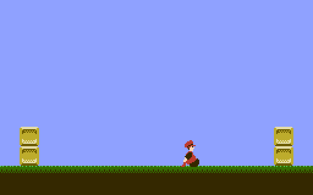

IF THIS FILE HAS NO LINE BREAKS:  View it in a web browser.  
(Some text editors do not understand UNIX-style line breaks.)

BNROM template
==============

This is a minimal working program for the Nintendo Entertainment
System using the BNROM, AMROM, ANROM, or AOROM board.  It assumes
familiarity with [nrom-template].

Additional concepts illustrated:

* initializing the mapper
* loading tile data into CHR RAM
* calls from one PRG bank to another

With two left as exercises for readers:

* Changing from one nametable to the other (AOROM)
* Changing CHR ROM banks (Color Dreams, GTROM)

[nrom-template]: https://github.com/pinobatch/nrom-template

Setting up the build environment
--------------------------------
Building this demo requires cc65, Python, Pillow, GNU Make, and GNU
Coreutils.  For detailed instructions to set up a build environment,
see [nrom-template].

Organization of the program
---------------------------

### Include files

* `nes.inc`: Register definitions and useful macros
* `global.inc`: Global variable and function declarations

### Source code files

* `bnrom.s`: iNES header and driver for BNROM
* `init.s`: PPU and CPU I/O initialization code
* `main.s`: Main program
* `bankcalltable.s`: List of entry points called through a far call
  (one that goes from one bank to another)
* `chrram.s`: CHR RAM data setup
* `bg.s`: Background graphics setup
* `player.s`: Player sprite graphics setup and movement
* `pads.s`: Read the controllers in a DPCM-safe manner
  (not that DPCM is so useful on 32K mappers like BNROM)
* `ppuclear.s`: Useful subroutines for interacting with the NES PPU

Unlike the mapper driver in my other templates, the BNROM driver
includes the prolog and epilog of the NMI handler.  This saves and
restores all CPU registers as well as the current PRG ROM bank in
order to make an interbank call to the NMI handler.

Greets
------

* [NESdev Wiki] and forum contributors
* [FCEUX] team
* Joe Parsell (Memblers) for getting me into NESdev in the first place
* Jeremy Chadwick (koitsu) for more code organization tips

[NESdev Wiki]: http://wiki.nesdev.com/
[FCEUX]: http://fceux.com/

Legal
-----
The demo is distributed under the following license, based on the
GNU All-Permissive License:

> Copyright 2011-2018 Damian Yerrick
> 
> Copying and distribution of this file, with or without
> modification, are permitted in any medium without royalty provided
> the copyright notice and this notice are preserved in all source
> code copies.  This file is offered as-is, without any warranty.
